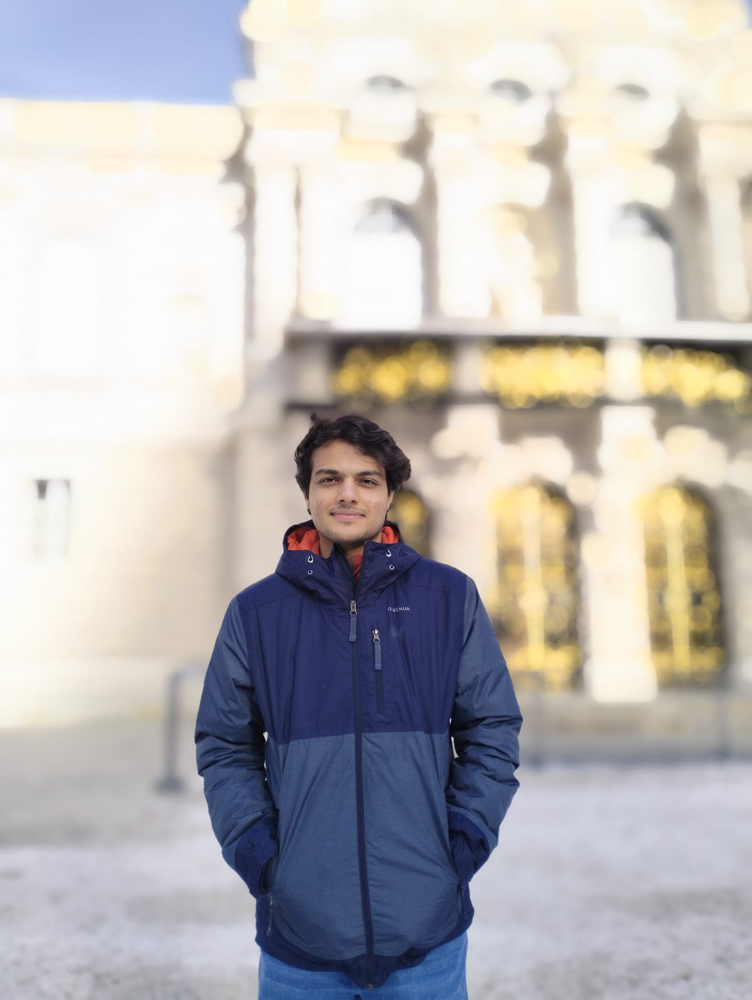

# Pradyun Hebbar

I am a recent BS-MS graduate from [IISER Pune](https://www.iiserpune.ac.in/) specializing in particle physics and machine learning applications. My study lies in the intersection of fundamental physics and machine learning. My research focuses on developing innovative machine learning techniques for high-energy physics experiments.

I completed my coursework with a GPA of 3.7/4 funded by the INSPIRE scholarship at IISER. I was also awarded the NEST (Nationwide Education and Scholarship Test) scholarship for my undergraduate education at IISER.

Beyond research, you can learn more about my [outreach activities](/outreach) and [international experiences](/experiences).

